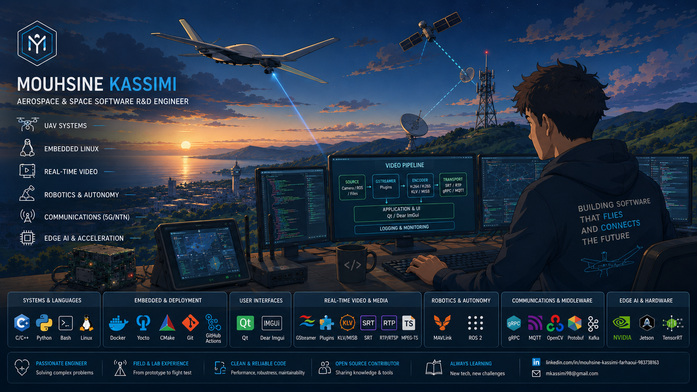

  

  

  
  
  

---

## 👋 About me

I work on software systems for aerospace, UAVs and advanced communications, with a strong focus on embedded Linux, real-time video pipelines, robotics middleware, edge AI and field-ready system integration.

My work usually sits at the intersection of:

* UAV payloads, ground control systems and onboard software
* Real-time video streaming, metadata and mission data transport
* Embedded Linux, C/C++, Python, Qt and GStreamer
* RF, 5G/NTN, BVLOS communications and operational validation
* Edge AI acceleration and deployment on constrained platforms

I like building software that is not only technically correct, but also usable in real engineering workflows: lab setups, integration benches, flight tests and field troubleshooting.

---

## 📊 GitHub activity

  
  

---

## 🚀 Some featured work

### [`gstklvplugin`](https://github.com/mkassimi98/gstklvplugin)

A GStreamer 1.x plugin suite for end-to-end KLV metadata workflows, including JSON↔KLV encode/decode, per-frame metadata injection, MPEG-TS signaling and STANAG/MISB-oriented video transport.

**Why it matters:** operational video is not just pixels. In aerospace and UAV systems, metadata such as platform position, attitude, sensor pointing and timestamps must travel with the video stream in a reliable and standard-oriented way.

**Tech:** C11 · GStreamer · KLV · MISB ST 0601 · STANAG 4609 · MPEG-TS · SRT · Meson · CMake

---

### [`ros2_gst_video_bridge`](https://github.com/mkassimi98/ros2_gst_video_bridge)

A generic ROS 2 video bridge that subscribes to image topics and forwards frames through configurable GStreamer pipelines.

**Why it matters:** it connects robotics camera streams with operational video transport, enabling ROS 2 systems to stream through SRT, RTSP, RTP/UDP, files or custom GStreamer sinks.

**Tech:** ROS 2 · C++ · GStreamer · appsrc · SRT · RTSP · RTP/UDP · Runtime configuration

---

### [`net_tools`](https://github.com/mkassimi98/net_tools)

Professional Linux network diagnostics, discovery and monitoring tools for engineering workshops, integration environments and field troubleshooting.

**Why it matters:** network issues in UAV and embedded systems are often solved faster when engineers have readable, repeatable and practical diagnostic tooling.

**Tech:** Python · Bash · Linux networking · SSH · VPN · Monitoring · Diagnostics

---

## 🛠️ Core stack

  <strong>UAV systems · Embedded Linux · Real-time video · Robotics middleware · Engineering UIs · Communications · Edge AI</strong>

<h3 align="center">Languages & systems programming</h3>

  

<h3 align="center">Embedded Linux, build systems & deployment</h3>

  

<h3 align="center">Engineering UIs & desktop tooling</h3>

  
    
  

<h3 align="center">Real-time video, robotics & computer vision</h3>

  
    
  
  
  
  

<h3 align="center">Middleware, messaging & data transport</h3>

  
    
  
  
  
  

<h3 align="center">Data, observability & diagnostics</h3>

  
    
  
  

<h3 align="center">Hardware targets, acceleration & edge AI</h3>

  
    
  
  
  

<h3 align="center">Aerospace, UAV & communications domain</h3>

  
  
  
  
  
  

 

  
    C · C++ · Python · Linux · Qt · Dear ImGui · GStreamer · ROS 2 · OpenCV · gRPC · MQTT · Kafka · KLV/MISB · UAV Comms · Edge AI
  

---

## 🤝 Connect

  
  

---

  <em>Building aerospace software that connects sensors, video, communications and field operations.</em>

